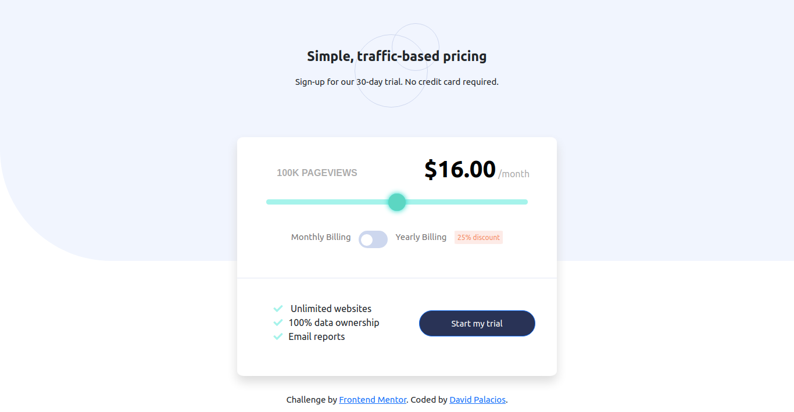

# Frontend Mentor - Interactive pricing component solution

This is a solution to the [Interactive pricing component challenge on Frontend Mentor](https://www.frontendmentor.io/challenges/interactive-pricing-component-t0m8PIyY8). Frontend Mentor challenges help you improve your coding skills by building realistic projects. 

## Table of contents

- [Overview](#overview)
  - [The challenge](#the-challenge)
  - [Screenshot](#screenshot)
  - [Links](#links)
  - [Built with](#built-with)
- [Author](#author)

## Overview

### The challenge

Users should be able to:

- View the optimal layout for the app depending on their device's screen size
- See hover states for all interactive elements on the page
- Use the slider and toggle to see prices for different page view numbers

### Screenshot

### Links

- Solution URL: https://www.frontendmentor.io/solutions/challenge-completed-using-bootsrap-and-custom-css-lBzZrU-wp

- Live Site URL: https://davidpalaciosg.github.io/interactive-pricing-component/

### Built with

- Semantic HTML5 markup
- CSS custom properties
- Flexbox
- CSS Grid
- Mobile-first workflow
- [Bootstrap](https://getbootstrap.com/) - JS library
- [Styled Components](https://styled-components.com/) - For styles

## Author

- Website - [David Palacios G](https://davidpalaciosg.com/)
- Frontend Mentor - [@davidpalaciosg](https://www.frontendmentor.io/profile/davidpalaciosg)
- GitHub - [@davidpalaciosg](https://github.com/davidpalaciosg)
